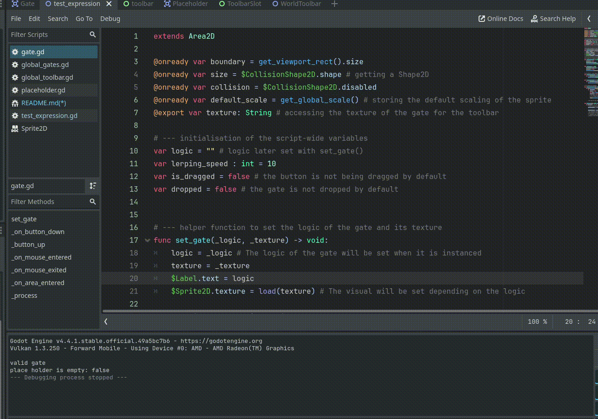

# 🎮 Quaze (Gate + Quiz)

## 👩🏿‍🔧 Basic Explanation

**Quaze** is a guessing game where a logic expression pops on the screen and the player must complete a logic circuit with the appropriate gate(s).

---

## 💡 Motivation / Problem

I kind of struggled understanding logic gates as an AS-level Computer Science student, so I am making this game to make logic gates more visual and fun.  
Additionally, I want to practice what I have learned in Godot so far and see if I am able to make a simple puzzle game.

---

## 🎮 Gameplay Description

- Each level presents a partial or empty logic circuit and a logic expression.
- The player must drag the correct logic gates from the toolbar into the circuit board to match the target logic expression.
- Once placed, the circuit will simulate and show whether the output matches the expected result.

---

## ✨ Key Features
	
- **Generation of Random Logic Expression**  
  -  Each level features a hand-designed logical expression such as `A AND B` or `NOT A OR B`.
  -  Expressions are manually crafted to ensure they are valid, progressively challenging, and suitable for learning or gameplay.
  -  Note: The initial idea was to randomly generate logic expressions, but I decided to focus on curated levels first for simplicity and better design control.

- **Inventory Bar of Available Gates**  
  - Each level provides the minimum number of logic gates needed to solve the puzzle, plus some distractor “dummy” gates in a toolbar

- **Premade Circuit to Complete**  
  - Some levels will include pre-placed gates (either correctly or incorrectly), and the player must complete the rest of the circuit

- **Drag-and-Drop Functionality**  
  - Players can drag gates from the toolbar and place them into specific circuit slots

- **Animations and Feedback**  
  - Satisfying animations and sound effects when the circuit is completed (whether successful or not)

---

## 🚀 Stretch Goals

- Level selector
- Save and load system
- Hint button showing the truth table
- Scoring system

---

## 🥳 Success Criteria

I will consider the project complete if:

- All key features work properly
- The game is uploaded to GitHub with screenshots and videos
- The game is playable from start to finish
- The project has a good README and documentation

---

## 💻 Tech Stack

- [Godot Engine](https://godotengine.org/) – Game engine
- **GDScript** – For scripting
- [Krita](https://krita.org/) – For creating game art

---

## 😉 Updates

07/06/2025

The drag n drop and toobar are complete and seem to work just fine. 
Here is a look of my progress:

